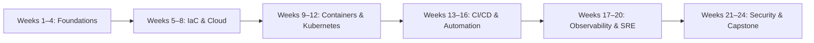

# DevOps Learning Roadmap (24 Weeks)

**Goal:** Build production-ready DevOps foundations with hands-on artifacts (IaC, CI/CD, Kubernetes, Observability, Security).

**Time Commitment:** ~3–5 hours/week (light cadence)

**Background Assumed:** Intermediate Python

---

## Overview

* **Duration:** 24 weeks (168 days)
* **Cadence:** 2 short weekday sessions (30–45 min) + 1 longer weekend session (1.5–2 hrs)
* **Deliverables:** Runnable labs, configs, pipelines, and clear READMEs
* **Cost Safety:** Prefer free tiers, local labs (Minikube/kind), and tear-down steps

---

## Roadmap at a Glance

---

## Block 0 (Week 1): Orientation & Lab Setup

**Focus:** Repo setup, tooling, cost guardrails

* Create repo structure
* Install Git, Python, Docker, editor
* Define lab & teardown plan

**Deliverables:** `roadmap.md`, `setup_notes.md`, `lab_plan.md`

---

## Block 1 (Weeks 2–5): Foundations

**Focus:** Linux, networking, Git, Python for ops

* Linux basics, shell scripting
* Git workflows
* Networking fundamentals
* Monitoring commands
* Security basics

**Mini Project:** Server bootstrap (nginx + health check)

**Deliverables:** Cheatsheets, scripts, README

---

## Block 2 (Weeks 6–9): IaC & Cloud Basics

**Focus:** Terraform, networking, storage, state

* Terraform basics & modules
* VPC/subnets/security
* Remote state & locking
* Cost control & tagging

**Mini Project:** IaC repo (network + compute + storage)

**Deliverables:** Terraform modules, plans, READMEs

---

## Block 3 (Weeks 10–13): Containers & Kubernetes

**Focus:** Docker, k8s fundamentals

* Dockerfiles & local runs
* Minikube/kind
* Deployments, services, ingress
* Helm basics

**Mini Project:** App deployed to k8s with Helm

**Deliverables:** Dockerfiles, k8s manifests, Helm chart

---

## Block 4 (Weeks 14–17): CI/CD & Automation

**Focus:** Pipelines, testing, GitOps

* GitHub Actions
* Build/test/publish images
* IaC in CI
* GitOps concepts

**Mini Project:** End-to-end CI/CD pipeline

**Deliverables:** Workflows, pipeline docs

---

## Block 5 (Weeks 18–21): Observability & SRE

**Focus:** Metrics, logs, SLOs

* Prometheus & Grafana
* Logging (Loki/ELK concepts)
* Alerts & runbooks
* Incident tabletop

**Mini Project:** Observability stack with SLO alerts

**Deliverables:** Dashboards, configs, runbooks

---

## Block 6 (Weeks 22–24): Security & Capstone

**Focus:** DevSecOps, scanning, secrets

* Dependency & image scanning
* Secret management
* Compliance basics

**Capstone:** Production-ready system with IaC, CI/CD, k8s, observability, and security

**Deliverables:** Final repo, README, runbook, demo notes

---

## Milestones

* **Week 4:** Ops automation basics
* **Week 8:** IaC module + state demo
* **Week 12:** Container & k8s deployment
* **Week 16:** CI/CD automation
* **Week 20:** Observability & SRE practices
* **Week 24:** Full capstone

